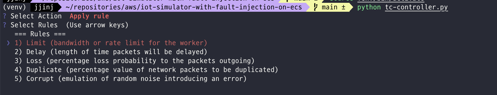
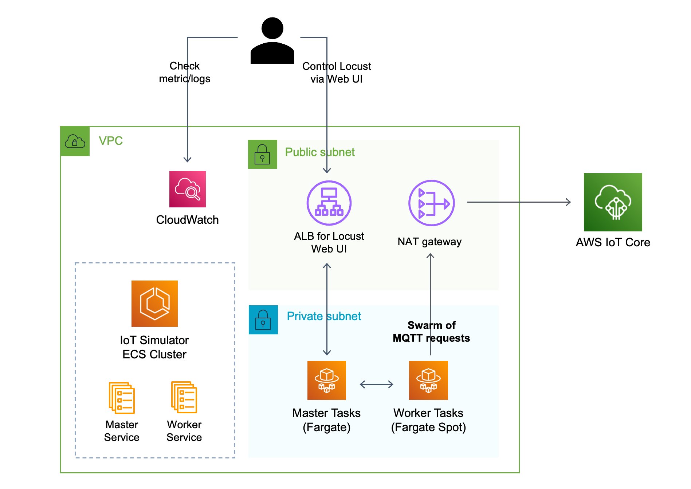
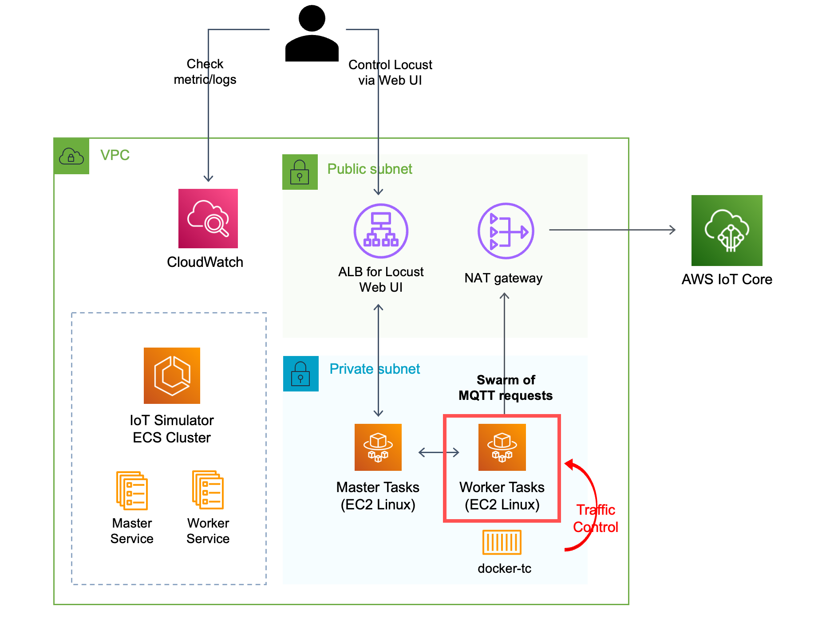

# IoT Simulator with Fault Injection Load Testing with Locust on Amazon ECS

[](https://github.com/aws-samples/distributed-load-testing-with-locust-on-ecs/actions/workflows/build.yml)

This sample shows you how to deploy IoT Simulator with two CDK stacks;
1) `IoTFaultInjectionSimulatorStack`
   - **Control network traffic on your IoT application**, to simulate real-world environment where network quality may vary.
   - Able to **monitor how your IoT application**, IoT Core and attached backend services react to different **network conditions**. 
2) `IoTLoadTestingSimulatorStack`
   - Load testing tool that simulates hundreds to millions of IoT devices.
   - Able to monitor how IoT Core scales out, MQTT ingestion latency or throttling scenarios.

This sample uses [Locust](https://locust.io/), a modern load testing framework, installed on [Amazon Elastic
Container Service (ECS)](https://aws.amazon.com/ko/ecs/) of which workers are configured to send MQTT topic to
configured [AWS IoT Core](https://aws.amazon.com/ko/iot-core/) endpoint. 

It leverages a serverless compute engine [Fargate](https://aws.amazon.com/fargate/) with spot
capacity in `IoTLoadTestingSimulatorStack` stack or [Amazon ECS Linux container instance](https://docs.aws.amazon.com/AmazonECS/latest/developerguide/ECS_instances.html)
if configured `IoTFaultInjectionSimulatorStack`.


## How to use

To deploy this sample to your own AWS account, please follow the steps below.

### 1. Prerequisites

Before you deploy, make sure you install the following tools in your local environment.

* Docker
* Node.js (v14 or newer)
* AWS CLI

Also you need Administrator IAM policy to deploy this sample.

### 2. Setup CDK

After confirming the parameters, you can proceed to CDK deployment.

First, you need to setup CDK environment by the following command:

```sh
npm ci
npx cdk bootstrap
```

You only need those commands once for your AWS environment (pair of account ID and region.)

### 3. Select Stack and deploy

Each stack has different ways to deploy and use. Please follow guides for each Stacks.
- 👉 [**Guide for `IoTFaultInjectionSimulatorStack`**](#3a-deploy-iotfaultinjectionsimulatorstack)
- 👉 [**Guide for `IoTLoadTestingSimulatorStack`**](#3b-deploy-iotloadtestingsimulatorstack)

-----

### 3.a Deploy `IoTFaultInjectionSimulatorStack`

> In this mode, you can simulate Network Traffic environment (packet limit, delay, duplicate, corrupt etc.)

#### 3.a.1 Set Parameters

Before deploy, you need to first decide what Stack to deploy to your AWS account. If you decided which stack
to deploy, please open [cdkconfig.ts](cdkconfig.ts) and browse to the stack class you want to run.

```typescript
new IoTFaultInjectionSimulatorStack(app, 'IoTFaultInjectionSimulatorStack', {
  env: {
    // AWS region to deploy this stack to. (Required for defining ALB access logging)
    region: 'ap-northeast-2',
  },
```

Starting from this class, you may change parameters in it. Below is the list of parameters for each Stack classes.

#### Parameters
- `region`: Specify which AWS region to deploy this stack to.
- `mqttWaitTime`: Frequency of publishing MQTT message to IoT Core
- `mqttQos`: QoS strategy of MQTT (e.g 0, 1, 2)
- `iotCoreEndpoint`: IoT Core endpoint you want to send MQTT message to.
- `iotCoreMqttTopic`: IoT Core topic you want to send MQTT message to.
- `iotThingName`: IoT Core ThingName you want to use.

#### 3.a.2 Run cdk deploy

Now you can deploy your desired CDK stack project.

```sh
npx cdk deploy IoTFaultInjectionSimulatorStack
```

Deployment usually takes less than 10 minutes.

After a successful deployment, you can find some stack outputs like below in your terminal:

```
✅  IoTFaultInjectionSimulatorStack

✨  Deployment time: 345.05s

Outputs:
IoTFaultInjectionSimulatorStack.EcsClusterArn = arn:aws:ecs:ap-northeast-2:238877058502:cluster/IoTFaultInjectionSimulatorStack-ClusterEB0386A7-qrqkA5UvvmmO
IoTFaultInjectionSimulatorStack.LocustTcMasterServiceLoadBalancerDNS07BFB9C9 = IoTFa-Locus-12SMMWMV2A4R1-1361692780.ap-northeast-2.elb.amazonaws.com
IoTFaultInjectionSimulatorStack.LocustTcMasterServiceServiceURL8DCFF8A9 = http://IoTFa-Locus-12SMMWMV2A4R1-1361692780.ap-northeast-2.elb.amazonaws.com
IoTFaultInjectionSimulatorStack.TrafficControlURL = http://IoTFa-LB8A1-DBVYJ7TJWA8I-1059475595.ap-northeast-2.elb.amazonaws.com:4080
IoTFaultInjectionSimulatorStack.WorkerServiceName = IoTFaultInjectionSimulatorStack-LocustTcWorkerServiceE6DBA4C5-copxuxqVTf6C
Stack ARN:
arn:aws:cloudformation:ap-northeast-2:238877058502:stack/IoTFaultInjectionSimulatorStack/0ce865b0-d800-11ed-8c5e-0a71badfd726

✨  Total time: 350.28s
```

### 3.a.3 Locust UI
From now on, 

After that, please make sure that you can open the URL in `LocustLTMasterServiceServiceURLF6337D0A` and view Locust Web GUI like
below image.


### 3.a.4 Run tc-controller.py
In order to dynamically change Network Traffic on worker, we should use `tc-controller.py`!

Navigate to [tc-controller.py](tc-controller.py), change the `BASE_API_URL` to the value you found in CDK output, `IoTFaultInjectionSimulatorStack.TrafficControlURL`.

```python
BASE_API_URL = "<FILL_THIS_PART>"  # e.g http://iotfa-lb8a1-15491mhxo6avf-1922776115.ap-northeast-2.elb.amazonaws.com:4080
```

After specifying `BASE_API_URL`, run the script.

> `python3.10` or higher may have ImportError issue.

- `virtualenv venv -p $(which python3.8) && source venv/bin/active`
- `pip install -r requirements.txt`
- `python3 tc-controller.py`




#### NOTE for `tc-controller.py`

The stack makes use of [`docker-tc`](https://github.com/lukaszlach/docker-tc). Docker
Traffic Control allows to set a rate limit on the container network and can emulate network conditions like delay,
packet loss, duplication, and corrupt for the Docker containers, all that basing only on labels. HTTP API allows to
fetch and pause existing rules and to manually overwrite them, command-line interface is also available.

Followings are the possible options you can apply to Locust worker using [tc-controller.py](tc-controller.py);

* **`Bandwidth Limit`** - bandwidth or rate limit for the container, accepts a floating point number, followed by a
  unit, or a percentage value of the device's speed (e.g. 70.5%). Following units are recognized:
    * `bit`, `kbit`, `mbit`, `gbit`, `tbit`
    * `bps`, `kbps`, `mbps`, `gbps`, `tbps`
    * to specify in IEC units, replace the SI prefix (k-, m-, g-, t-) with IEC prefix (ki-, mi-, gi- and ti-)
      respectively
* **`Packet Delay`** - length of time packets will be delayed, accepts a floating point number followed by an optional
  unit:
    * `s`, `sec`, `secs`
    * `ms`, `msec`, `msecs`
    * `us`, `usec`, `usecs` or a bare number
* **`Packet Loss`** - percentage loss probability to the packets outgoing from the chosen network interface
* **`Packet Duplicate`** - percentage value of network packets to be duplicated before queueing
* **`Packet corrupt`** - emulation of random noise introducing an error in a random position for a chosen percent of
  packets


Now the deployment is completed! You can start to use Locust load tester.

-----

### 3.b Deploy `IoTLoadTestingSimulatorStack`

> In this stack, you can simulate hundreds of thousands devices and load test to IoT Core Endpoint.

#### 3.b.1 Set Parameters

Before deploy, you need to first decide what Stack to deploy to your AWS account. If you decided which stack
to deploy, please open [cdkconfig.ts](cdkconfig.ts) and browse to the stack class you want to run.

```typescript
new IoTLoadTestingSimulatorStack(app, 'IoTLoadTestingSimulatorStack', {
  env: {
    // AWS region to deploy this stack to. (Required for defining ALB access logging)
    region: 'ap-northeast-2',
  },
  ...,
```
> Note that each `IoTLoadTestingSimulatorStack` stack has additional parameter, 
> - `workerDesiredCount`: Please adjust this number depending on the number of devices you want to simulate. If you want to simulate millions of devices, you may have to increase this parameter by >100.

#### 3.b.2 Run cdk deploy

Now you can deploy your desired CDK stack project.

```sh
npx cdk deploy IoTLoadTestingSimulatorStack
```

Deployment usually takes less than 10 minutes.

After a successful deployment, you can find some stack outputs like below in your terminal:

```
IoTLoadTestingSimulatorStack: creating CloudFormation changeset...

 ✅  IoTLoadTestingSimulatorStack

✨  Deployment time: 304.06s

Outputs:
IoTLoadTestingSimulatorStack.EcsClusterArn = arn:aws:ecs:ap-northeast-2:238877058502:cluster/IoTLoadTestingSimulatorStack-ClusterEB0386A7-NLtSdKWk5oQt
IoTLoadTestingSimulatorStack.LocustLTMasterServiceLoadBalancerDNS4DCA9946 = IoTLo-Locus-1TDKKP5MMLWUV-1796556184.ap-northeast-2.elb.amazonaws.com
IoTLoadTestingSimulatorStack.LocustLTMasterServiceServiceURLF6337D0A = http://IoTLo-Locus-1TDKKP5MMLWUV-1796556184.ap-northeast-2.elb.amazonaws.com
IoTLoadTestingSimulatorStack.WorkerServiceName = IoTLoadTestingSimulatorStack-LocustLTWorkerService79BDE724-pk1K3kAb87LN
Stack ARN:
arn:aws:cloudformation:ap-northeast-2:238877058502:stack/IoTLoadTestingSimulatorStack/3f86c240-d7fc-11ed-acf1-0a297bde0576

✨  Total time: 311.17s
```

### 3.b.3 Locust UI
From now on, 

You need the value of `EcsClusterArn` and `WorkerServiceName` in later steps, so it is recommended that you take a note
of those values.

After that, please make sure that you can open the URL in `LocustLTMasterServiceServiceURLF6337D0A` and view Locust Web GUI like
below image.


Now the deployment is completed! You can start to use Locust load tester.

## Clean up

To avoid incurring future charges, clean up the resources you created.

You can remove all the AWS resources deployed by this sample running the following command:

```sh
npx cdk destroy --force
```

## How it works

We deploy Locust with distributed mode, so there are two ECS services, master service and worker service. The number 
of Locust master instance is always one, and it can be accessed via Application Load Balancer.

On the other hand, there can be *N* Locust worker instances, which is usually the dominant factor of load test
infrastructure cost.

In `IoTLoadTestingSimulatorStack`, we use Fargate spot capacity for worker instances, which allows you to run load test at most
70% cheaper than on-demand capacity. Below is the architecture diagram of this mode.

* **`IoTLoadTestingSimulatorStack`**
  

However, if using `IoTFaultInjecitonSimulatorStack`, we use ECS Linux instance instead of Fargate spot capacity for worker
instances. The reason is because of the `docker-tc` unique behavior. Following is the detailed information about the
behavior and the reason for using Linux instance.

* `docker-tc` scans all running containers and starts listening for container:start events triggered by Docker Engine.
  When a new container is up (also a new Swarm service) and contains `com.docker-tc.enabled` label set to `1`, Docker
  Traffic Control starts applying network traffic rules according to the rest of the labels
  from `com.docker-tc namespace` it finds.
* When it scans new container, the docker network should be the custom docker network. If the network of the worker
  container is either default network such as `host` or `bridge`, `docker-tc` will not be able to scane the network
  interface thus not being able to restrict network traffic of that containers.
* **Since Fargate does not support custom docker network mode**, we need to use Linux container to be run with `host`
  mode, and make that container to launch another locust worker container that has custom docker network.
* _**This work flow can be fixed easily if either Fargate starts support custom docker network OR we modify the source
  of `docker-tc` and build new image for implementation.**_

Below is the architecture diagram of this mode.

* **`IoTFaultInjecitonSimulatorStack` Mode**
  

Note that all the access from Locust workers go through NAT Gateway, which makes it easy to restrict access by IP
addresses on load test target servers, because all the Locust workers shares the same outbound IP address among them.


## Security

See [CONTRIBUTING](CONTRIBUTING.md#security-issue-notifications) for more information.

## License

This library is licensed under the MIT-0 License. See the LICENSE file.
